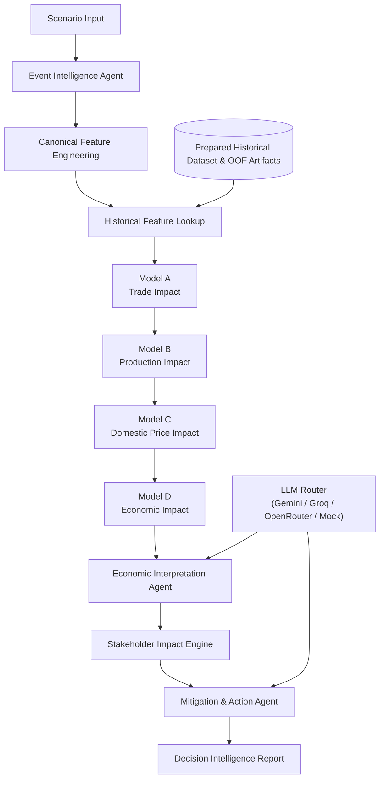

# Drishti — Geopolitical Agricultural Decision Intelligence

Drishti is a hierarchical agentic decision-intelligence framework that translates geopolitical and trade-related events into quantitative agricultural, economic, stakeholder, and mitigation insights through deterministic feature engineering, a cascading ML pipeline, historical feature retrieval, and LLM-powered interpretation and advisory generation.

---

## Project Overview

Drishti evaluates how geopolitical disruptions propagate through India's agricultural economy via a multi-stage quantitative econometric cascade:

$$\text{Geopolitical Event} \longrightarrow \text{Trade Flow (Model A)} \longrightarrow \text{Domestic Production (Model B)} \longrightarrow \text{Wholesale Prices (Model C)} \longrightarrow \text{Macroeconomic GVA \& Inflation (Model D)}$$

### Phase-1 Architecture

In Phase 1, the framework operates as an end-to-end decision-support pipeline designed for rigorous, reproducible scenario evaluation. Rather than relying on non-deterministic live GDELT API streaming, Phase 1 uses structured scenario inputs combined with canonical feature engineering, historical feature lookups from prepared datasets, and chronological walk-forward out-of-fold (OOF) cascade artifacts.

```
Manual Scenario Input
        ↓
Event Intelligence
        ↓
Canonical Feature Engineering
        ↓
Historical Feature Lookup
        ↓
ML Cascade (Model A → Model B → Model C → Model D)
        ↓
Economic Interpretation Agent
        ↓
Stakeholder Impact Assessment Engine
        ↓
Mitigation & Action Playbook Agent
        ↓
Dynamic LLM Usage Reporting
```

---

## Architecture Diagram



---

## Core Components

### 1. Canonical Feature Engineering & Historical Lookup
- **Deterministic Calculation**: Computes canonical features directly from scenario parameters (e.g. `Shock_Intensity`, `Trade_Share`, `Effective_Shock = Shock_Intensity * (Trade_Share / 100)`).
- **Sorted Chronological Lookup**: Features requiring historical baseline values (such as previous-period trade returns, CPI momentum, climate indices, and lagged crop production) are retrieved from the verified historical dataset using sorted $< T$ chronological entity lookups on `(Country, Trade_Type, HS4)`.
- **Zero-Fill Prevention**: Unavailable lag features are explicitly reported rather than silently zero-filled.

### 2. Cascading ML Pipeline
- **Model A (Trade Impact)**: Predicts 1-month bilateral trade flow return ($\Delta\%$) using LightGBM.
- **Model B (Agricultural Impact)**: Predicts YoY national production growth and classifies Production Risk (`LOW`, `MODERATE`, `HIGH`) using XGBoost & LightGBM.
- **Model C (Price Impact)**: Predicts 1-month domestic wholesale price return ($\Delta\%$) using XGBoost conditioned on previous-period Model B crop production forecasts.
- **Model D (Agri-Economic Impact)**: Jointly forecasts quarterly Agricultural GVA Growth ($\%$) and 3-month Food Inflation delta ($\text{pp}$) using Ridge Regression.
- **Temporal Invariance**: All downstream models are trained and linked using expanding-window walk-forward out-of-fold (OOF) predictions with $\text{Training\_End\_Year} < \text{Prediction\_Year}$.

### 3. Stakeholder Impact Engine
- Evaluates directional impact, severity, and confidence across 6 key stakeholder dimensions:
  1. **Farmers** (Producer price realization, production risk)
  2. **Consumers** (Food inflation, price transmission)
  3. **Exporters** (Export volume, export restrictions — dynamically omitted/marked N/A for import flows)
  4. **Importers** (Import supply-chain tightness — dynamically omitted/marked N/A for export flows)
  5. **Regional** (Agro-climatic and seasonal risk)
  6. **Government** (Macro food security, buffer stock calibration, overall risk)

### 4. Multi-Provider Resilient LLM Router
- **Provider Cascade**: Primary: **Google Gemini** (`gemini-3.6-flash`) $\rightarrow$ Secondary: **Groq** (`openai/gpt-oss-120b`) $\rightarrow$ Tertiary: **OpenRouter** $\rightarrow$ Quaternary: **Offline Deterministic Mock**.
- **₹0 / Free-Tier Guaranteed**: Operates completely within free API quotas.
- **Zero Hallucination Guardrail**: LLMs generate **ZERO** quantitative inputs or model predictions for the ML cascade. LLMs are restricted strictly to qualitative economic interpretation, non-causal synthesis, and policy mitigation playbooks.
- **Dynamic Tracking**: Every report dynamically identifies the exact LLM provider and model that generated each response.

---

## Repository Structure

```
├── agents/                           # Agentic decision-intelligence layer
│   ├── event_intelligence_agent.py   # Event parsing, validation & structured scenario mapping
│   ├── impact_interpretation_agent.py# Non-causal econometric ML synthesis
│   ├── mitigation_action_agent.py    # Grounded stakeholder mitigation playbooks
│   ├── stakeholder_advisory_agent.py # Disaggregated 6-dimension stakeholder rules engine
│   └── orchestrator.py               # Master agent orchestrator & CLI report formatter
├── config/                           # Environment configuration and provider settings
│   └── settings.py
├── data/                             # Raw & processed datasets and event catalog
│   ├── Drishti_Cascade_Final_With_EMDAT.csv
│   ├── Crop_Production_Final.csv
│   └── event_catalog.json
├── drishti_mcp/                      # Model Context Protocol (MCP) tool integration
│   ├── drishti_mcp_server.py         # MCP stdio JSON-RPC server
│   └── tools/
│       ├── event_store_tool.py       # Event catalog search & window analytics
│       ├── feature_engine.py         # Canonical feature engineering & OOF cascade lookups
│       ├── gdelt_tool.py             # Event parameter structuring
│       ├── ml_cascade_tool.py        # Synchronous ML cascade runner (Models A→B→C→D)
│       └── stakeholder_tool.py       # Stakeholder impact evaluator tool
├── llm/                              # Multi-provider LLM infrastructure
│   ├── gemini_client.py              # Gemini client wrapper
│   └── llm_router.py                 # Multi-provider resilient router (Gemini/Groq/OpenRouter/Mock)
├── models/                           # Trained canonical ML model artifacts
│   ├── model_a_trade.joblib          # Model A: Trade Return (LightGBM)
│   ├── model_b_production_yoy.joblib # Model B: Production Growth (XGBoost)
│   ├── model_b_production_risk.joblib# Model B: Production Risk Classifier (LightGBM)
│   ├── model_c_price.joblib          # Model C: Domestic Price Return (XGBoost OOF)
│   ├── model_d_agri_gva.joblib       # Model D: Agri GVA Growth (Ridge OOF)
│   └── model_d_inflation.joblib      # Model D: Food Inflation Delta (Ridge OOF)
├── results/                          # Validated OOF predictions, metrics & audit reports
│   ├── model_a_predictions_oof.csv
│   ├── model_b_predictions_oof.csv
│   ├── model_c_predictions_oof.csv
│   ├── cascade_results.json
│   ├── event_store.json
│   ├── stakeholder_advisories.json
│   ├── validation_report.json
│   └── phase2_provenance_audit.json
├── scenarios/                        # Phase-1 predefined canonical scenarios
│   └── scenarios.py                  # CLI runner for scenario execution
├── scripts/                          # Standalone ML training & pipeline audit scripts
│   ├── task1_data_validation.py      # Dataset integrity & formula audit
│   ├── train_model_a_trade.py        # Train Model A
│   ├── train_model_b_agriculture.py  # Train Model B
│   ├── generate_oof_predictions.py   # Chronological walk-forward OOF generator
│   ├── train_model_c_price.py        # Train Model C
│   ├── train_model_d_economy.py      # Train Model D
│   ├── cascade_orchestrator.py       # Standalone cascade digital twin
│   ├── stakeholder_engine.py         # Standalone stakeholder engine
│   ├── event_store.py                # Standalone event catalog analytics
│   └── validate_pipeline.py          # 114-point pipeline validation suite
├── tests/                            # Comprehensive regression & unit test suite (30 tests)
│   ├── test_agents.py
│   ├── test_feature_engine.py
│   ├── test_gdelt_tool.py
│   ├── test_llm_client.py
│   ├── test_mcp_tools.py
│   ├── test_ml_regression.py
│   ├── test_orchestrator.py
│   └── test_scenarios.py
├── requirements.txt
└── README.md
```

---

## Getting Started

### 1. Installation & Environment Setup

```powershell
# Clone the repository
git clone https://github.com/its-yashwanth/Dhrishti.git
cd Dhrishti

# Install dependencies
pip install -r requirements.txt
```

Create a `.env` file in the root directory (optional for LLMs; offline fallback works with zero keys):
```env
GEMINI_API_KEY=your_gemini_api_key
GROQ_API_KEY=your_groq_api_key
OPENROUTER_API_KEY=your_openrouter_api_key
```

---

## Execution Commands

### 1. Run Complete End-to-End Decision Scenarios

Execute predefined geopolitical scenarios covering both Import and Export trade flows:

```powershell
# List all predefined scenarios
python scenarios/scenarios.py --list

# Scenario 1: Russia Wheat Import Disruption (Import)
python scenarios/scenarios.py --scenario wheat_russia_conflict

# Scenario 2: Indonesia Palm Oil Export Restrictions & Levy (Import)
python scenarios/scenarios.py --scenario indonesia_palm_oil

# Scenario 3: India Wheat Export Restrictions to Bangladesh (Export)
python scenarios/scenarios.py --scenario india_wheat_export

# Scenario 4: China Soybean Trade Tensions (Export)
python scenarios/scenarios.py --scenario china_soybean_trade

# Scenario 5: Red Sea Shipping & Freight Disruption on Pepper (Export)
python scenarios/scenarios.py --scenario red_sea_shipping_disruption
```

### 2. Run Custom Geopolitical Events (CLI Orchestrator)

Execute custom scenario queries directly through the agent orchestrator:

```powershell
# Custom Import Scenario (e.g. Russia Wheat)
python agents/orchestrator.py --query "Russia wheat export disruption and Black Sea tensions" --country "RUSSIA" --commodity "Wheat" --hs4 1001 --trade-type "Import" --shock-intensity 1.5 --trade-share 5.0 --year 2024 --month 6

# Custom Export Scenario (e.g. Pepper to UAE)
python agents/orchestrator.py --query "Maritime shipping disruption and freight rate surge in Gulf" --country "UNITED ARAB EMIRATES" --commodity "Pepper" --hs4 904 --trade-type "Export" --shock-intensity 2.0 --trade-share 10.0 --year 2024 --month 6
```

### 3. Run Standalone ML Training & Validation Scripts

To retrain individual ML models or generate walk-forward OOF predictions:

```powershell
# 1. Validate dataset formulas and lag definitions
python scripts/task1_data_validation.py

# 2. Train baseline models & generate upstream walk-forward OOF predictions
python scripts/train_model_a_trade.py
python scripts/train_model_b_agriculture.py
python scripts/generate_oof_predictions.py

# 3. Retrain downstream models on OOF inputs
python scripts/train_model_c_price.py
python scripts/train_model_d_economy.py

# 4. Run standalone cascade orchestrator & stakeholder analytics
python scripts/cascade_orchestrator.py
python scripts/stakeholder_engine.py
python scripts/event_store.py
```

### 4. Run Verification & Test Suites

```powershell
# Run the complete 30-test regression test suite
python -m unittest discover tests -v

# Run the 114-check pipeline integrity verification suite
python scripts/validate_pipeline.py
```

---

## Sample Decision Report Output

```text
==========================================================================
                      DRISHTI DECISION INTELLIGENCE                       
==========================================================================

EVENT
--------------------------------------------------------------------------
  Date          : 2024-06-15
  Country       : RUSSIA
  Event Code    : 180 (Root: 18)
  Goldstein     : -9.0
  Avg Tone      : -6.5

SCENARIO CONTEXT
--------------------------------------------------------------------------
  Commodity     : Wheat
  HS4           : 1001
  Trade Type    : Import
  Trade Share   : 5.0%
  Shock         : 1.5

QUANTITATIVE ML CASCADE
--------------------------------------------------------------------------
  Model A — Trade Return 1M       : -0.76%
  Model B — Production Growth     : +9.46%
  Model B — Production Risk       : LOW
  Model C — Price Return 1M       : -0.01%
  Model D — Agri GVA Growth       : +4.64%
  Model D — Food Inflation 3M     : -1.41 pp

  Cascade Status: A -> B -> C -> D [COMPLETE (5/5)]

==========================================================================
                    STAKEHOLDER IMPACT                    
==========================================================================

FARMERS
--------------------------------------------------------------------------
Impact       : NEGATIVE
Severity     : LOW
Confidence   : MEDIUM

Why?
Lower wheat prices may reduce producer price realization.

Key Evidence
• Model C Price Return 1M : -0.01%
• Model B Production Risk : LOW
• Production Growth       : +9.46%


CONSUMERS
--------------------------------------------------------------------------
Impact       : POSITIVE
Severity     : LOW
Confidence   : MEDIUM

Why?
The projected near-term decline in wheat prices could reduce consumer food
expenditure.

Key Evidence
• Model C Price Return 1M : -0.01%
• Food Inflation 3M Delta : -1.41 pp


EXPORTERS
--------------------------------------------------------------------------
Impact       : NOT APPLICABLE

Reason
The scenario represents an import flow into India.


IMPORTERS
--------------------------------------------------------------------------
Impact       : NEGATIVE
Severity     : MODERATE
Confidence   : HIGH

Why?
The projected import contraction indicates potential supply-chain
tightness for Indian wheat importers from RUSSIA.

Key Evidence
• Model A Trade Return 1M : -0.76%
• Trade Flow              : Import


REGIONAL
--------------------------------------------------------------------------
Risk         : LOW
Confidence   : HIGH

Why?
The agricultural model projects positive production growth with a Low
Production Risk classification.

Key Evidence
• Production Growth       : +9.46%
• Production Risk         : LOW
• Season                  : Kharif


GOVERNMENT
--------------------------------------------------------------------------
Overall Risk : LOW-MODERATE
Confidence   : HIGH

Key Indicators
• Trade Return 1M        : -0.76%
• Production Growth      : +9.46%
• Price Return 1M        : -0.01%
• Agricultural GVA       : +4.64%
• Food Inflation Delta   : -1.41 pp

Interpretation
The scenario indicates weaker import flows, while domestic production
remains resilient and projected food inflation moderates (-1.41 pp).

==========================================================================
MITIGATION & ACTIONS
==========================================================================

Government:
  - Calibrate strategic wheat reserves and utilize Open Market Sale Scheme
  (OMSS) buffer protocols to absorb modest import contractions (-0.76%).
  - Review import duty frameworks and evaluate flexible Tariff Rate Quota (TRQ)
  mechanisms for wheat to facilitate alternative origin procurement.

Farmers:
  - Utilize Minimum Support Price (MSP) procurement windows to hedge against
  minor negative domestic price movements.
  - Leverage electronic Negotiable Warehouse Receipts (e-NWRs) to store
  harvested grain and avoid distress selling.

Consumers:
  - Maintain stabilized grain allocations through the Public Distribution System
  (PDS) to ensure food security for vulnerable consumer segments.

Exporters:
  - For processed wheat product exporters, implement multi-origin raw material
  hedging to manage input availability risks.

Importers:
  - Establish diversified origin contracting with alternative major wheat
  suppliers (such as Australia or Canada) to build supply chain redundancy.

--------------------------------------------------------------------------
LLM USAGE
--------------------------------------------------------------------------
  Economic Interpretation : Gemini — gemini-3.6-flash
  Mitigation              : Gemini — gemini-3.6-flash
==========================================================================
```

---

## Chronological Data Splits

| Split | Period | Purpose |
|---|---|---|
| **Train** | $\le 2022$ | Model training ($2018$ cold-start for OOF) |
| **Validation** | $2023$ | Hyperparameter optimization & model selection |
| **Test** | $\ge 2024$ | Frozen out-of-sample evaluation |

---

## Key Methodological Principles

- **Walk-Forward OOF Provenance**: All cascade links strictly use out-of-fold predictions with $\text{Training\_End\_Year} < \text{Prediction\_Year}$.
- **No Same-Period Leakage**: All upstream cascade features and target-adjacent indicators are strictly lagged prior to inclusion.
- **Directional Consistency**: Trade interpretations and stakeholder evaluations strictly differentiate between `Export` and `Import` flows.
- **Data Gap Transparency**: Fertilizer input costs (HS Ch. 31 absent) and unmapped non-crop agricultural periods are explicitly reported rather than fabricated.
- **Zero Hallucination Guarantee**: LLMs generate zero quantitative numbers for ML models; all predictions originate from frozen, validated ML artifacts.
